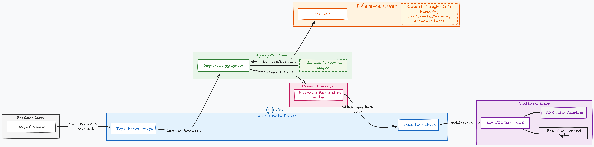

# VerdiX

https://github.com/user-attachments/assets/e8f3ec78-f212-4116-95e2-0d494988f29c


An autonomous AIOps pipeline for real-time root cause analysis (RCA) of distributed system logs. VerdiX ingests raw, interleaved HDFS-style logs, reconstructs per-block chronological event sequences across nodes, and hands the full block history to an LLM running a strict Chain-of-Thought (CoT) protocol to deduce a root cause against a fixed failure taxonomy and emit deterministic, executable remediation commands.

## Architecture



- **Log producer (`log_simulator.py`)** — generates realistic HDFS block lifecycle sequences (writes, replication, node failures) and streams them into a local Kafka topic (`hdfs_raw_logs`) at high throughput, standing in for a live production log source.
- **Aggregator (`backend/aggregator/main.go`)** — a Golang consumer that maintains real-time per-`block_id` state across all reporting nodes. Applies lightweight regex heuristics (`Exception`, `Failed`, etc.) as a fast-pass filter; sending every log line to an LLM is too slow and too expensive to do unconditionally. On a heuristic hit, the aggregator freezes state for that block, compiles its full chronological cross-node history, and dispatches it for diagnosis.
- **CoT reasoning engine** — the compiled block history is injected into a fixed prompt structure that constrains the LLM to a four-stage protocol designed to prevent hallucinated diagnoses:
  - `PREMISE` — factual, chronological summary of the distributed event sequence
  - `OBSERVATION` — explicit identification of the failure point
  - `DEDUCTION` — classification against a predefined HDFS Failure Taxonomy (`WRITE_PATH_FAILURE`, `REPLICATION_FAILURE`, `METADATA_INCONSISTENCY`, ...)
  - `ACTION` — deterministic, executable remediation commands, emitted as JSON
- **Real-time telemetry (WebSocket)** — the Go backend streams two channels to the frontend: raw ingestion rate (system health) and finalized CoT diagnostic reports.
- **Dashboard (`frontend/`, Vite)** — visualizes the live ingestion feed, per-node/block status, and the LLM's step-by-step reasoning trace and remediation actions as they're generated.

## Failure Taxonomy 

VerdiX moves  away from unbounded LLM queries and anchorsthe AI to a deterministic knowledge base. The Failure Taxonomy is the direct culmination of an extensive Exploratory Data Analysis (EDA) pipeline. By mathematically mining the HDFS dataset in our Jupyter notebooks, a recurring failure signatures and codified them into a strict JSON registry, has been extracted .

During the Chain-of-Thought (CoT) reasoning phase, this taxonomy is dynamically injected into the LLM's system prompt, acting as the absolute ground truth. The LLM is forced to map every observed anomaly strictly to one of the following mathematically derived failure modes, completely eliminating hallucination:

1. **`WRITE_PATH_FAILURE`** — Block write operation failed during data pipeline replication.
2. **`EMPTY_PACKET_LOOP`** — System stuck receiving empty packets in a loop, indicating data corruption.
3. **`SERVE_FAILURE`** — Block serving to clients failed, triggering emergency re-replication.
4. **`METADATA_INCONSISTENCY`** — NameNode metadata became inconsistent with actual block state.
5. **`REPLICATION_FAILURE`** — Block replication or transfer between DataNodes failed.
6. **`BLOCK_LIFECYCLE_ERROR`** — Error during block receive or delete operations.
7. **`INCOMPLETE_PIPELINE`** — Block write pipeline started but terminated silently without completion or error.
8. **`SILENT_RECOVERY`** — Block operations triggered emergency replication without logging an explicit error.

Each of the taxonomy entries above is strictly composed of the following components:
- **`description`** — High-level summary of the operational failure.
- **`key_events`** & **`4gram_signatures`** — The exact sequence vectors (e.g., `E22 -> E5 -> E5 -> E7`) that the EDA pipeline mathematically proved lead to this specific failure.
- **`symptoms`** — The human-readable manifestation of the sequence in the raw logs.
- **`root_cause`** — The physical or network-level reason the failure occurred.
- **`remediation`** — A deterministic JSON object containing the `action` type, `priority` level, and explicit `details` (translated into executable bash commands by the CoT engine).

The taxonomy file also stores the complete statistical foundation used by the pipeline:
- **`event_templates`** — The regex templates used to parse unstructured log text into discrete Event IDs (e.g., `E5`, `E22`).
- **`normal_baseline`** — Statistical benchmarks for a healthy cluster, including median block latency (`7303.0 ms`) and expected operational sequences, used to mathematically isolate deviations.
- **`anomaly_exclusive_4grams`** — A library of n-gram sequences identified by the EDA pipeline that *exclusively* appear during failures, proving causality.
- **`type_to_mode_mapping`** — Statistical clusters mapping raw error types to their actual failure mode based on mean sequence lengths and occurrence frequencies.

## Repository Structure

```text
VerdiX/
├── backend/
│   ├── aggregator/
│   ├── create_demo.py
│   ├── log_simulator.py
│   ├── docker-compose.yml       # Kafka & Zookeeper orchestration
│   └── Dockerfile.simulator     # Python log streamer container
├── frontend/
│   └── dashboard/
│       └── Dockerfile           # Multi-stage Vite build → nginx
├── notebooks/                   # Jupyter notebooks for EDA, log parsing, and CoT research
└── docker-compose.full.yml      # Full-stack single-command orchestration

```

## Getting started

### Option 1: Docker (Recommended):

Requires only Docker. No Go, Node, or Python installation needed.


```sh
docker-compose -f docker-compose.full.yml up
```

Serves on `http://localhost:5173`.

> The aggregator resets its block state after 10 seconds of idle, so the simulator can be re-triggered

### Option 2: Manual:

#### Prerequisites

- Docker (Kafka / Zookeeper)
- Go
- Node.js & npm
- Python 3.x
- An API Key for any OpenAI-compatible LLM provider 

#### 1. Configure credentials

Create `backend/aggregator/.env`:

```env
LLM_TOKEN=your_token_here
```

#### 2. Start Kafka

```sh
cd backend
docker-compose up -d
```

#### 3. Start the aggregator

```sh
cd backend/aggregator
go run main.go
```

#### 4. Start the dashboard

```sh
cd frontend/dashboard
npm install
npm run dev
```

Serves on `http://localhost:5173`.

#### 5. Stream logs

```sh
cd backend
python log_simulator.py
```


## Citation

VerdiX utilizes the HDFS_v1 dataset from Loghub for research, simulation, and taxonomy derivation. If you extend this work or use the dataset, please cite the following original papers:

> Wei Xu, Ling Huang, Armando Fox, David Patterson, Michael Jordan. *Detecting Large-Scale System Problems by Mining Console Logs*, in Proc. of the 22nd ACM Symposium on Operating Systems Principles (SOSP), 2009.

> Jieming Zhu, Shilin He, Pinjia He, Jinyang Liu, Michael R. Lyu. *Loghub: A Large Collection of System Log Datasets for AI-driven Log Analytics*. IEEE International Symposium on Software Reliability Engineering (ISSRE), 2023.